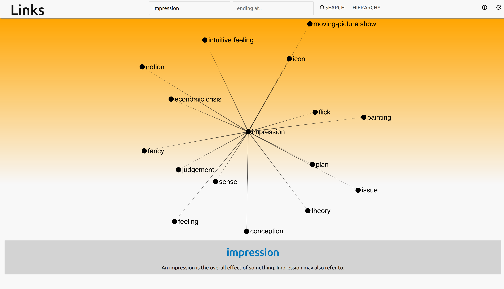

# links

Exploration of links in different web frameworks, using [big-data graph DB](https://github.com/dgoldstein1/graphApi) as a back-end.
[](https://circleci.com/gh/dgoldstein1/links)

[](https://codeclimate.com/github/dgoldstein1/links/maintainability)

[](https://codeclimate.com/github/dgoldstein1/links/test_coverage)



See a deployed version here: http://www.linklanguageconnections.com/


### Development

```console
docker-compose up -d
```

The dev app will be served on `localhost:3000`. The back-end is configured to use a randomly generated graph of nodes between 1-100. The back-end dashboard can be seen [here](http://localhost:3001/d/-ItR25vWz/crawler-backend-overview?orgId=1&refresh=5s), the password is admin:admin.


## Authors

* **David Goldstein** - [DavidCharlesGoldstein.com](http://www.davidcharlesgoldstein.com/?links) - [Decipher Technology Studios](http://deciphernow.com/)

## License

This project is licensed under the MIT License - see the [LICENSE.md](LICENSE.md) file for details
